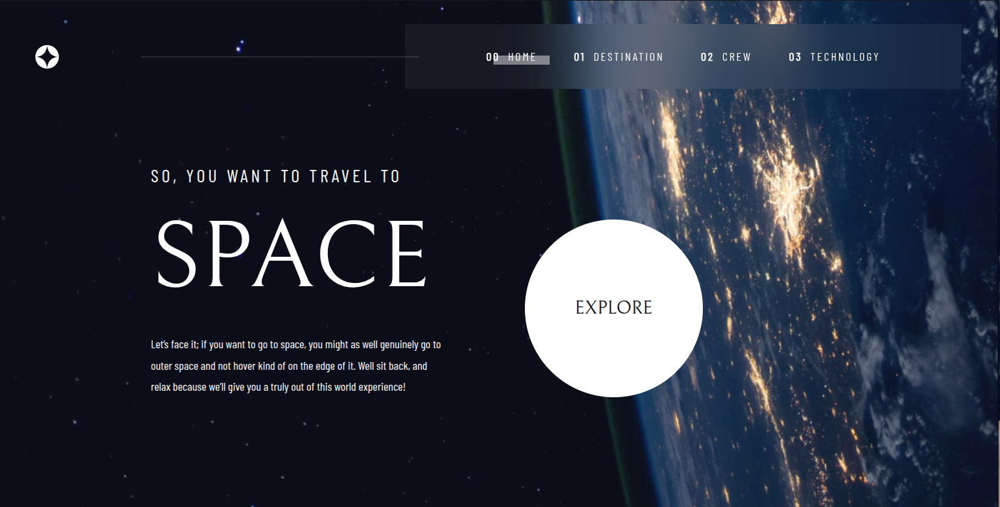

# Escape Velocity

Responsive multi-page UI built with Angular 19, TypeScript, and a token-based SCSS architecture.

**Live demo:** https://taliacoruja.github.io/escape-velocity



## Stack
Angular 19 · TypeScript · SCSS · CSS Grid · Flexbox · BEM

## Highlights
- Design token system (spacing, typography, color, breakpoints)
- Fluid typography and spacing with `clamp()`
- Responsive layouts across mobile / tablet / desktop
- Standalone Angular components with lazy routing
- CI/CD via GitHub Actions → GitHub Pages

## Testing
Jasmine + Karma · 108 tests 

Covered across all components:
- rendering — DOM structure and content
- component logic — getters, state updates, event handlers
- accessibility — `aria-*` attributes, roles, semantic markup
- outputs — `EventEmitter` interactions between components

## Structure
```
src/
├── app/
│   ├── core/
│   │   ├── layout/        # header, navigation
│   │   ├── models/        # TypeScript interfaces
│   │   └── services/      # DataService
│   └── pages/
│       ├── home/
│       ├── destination/
│       ├── crew/
│       └── technology/
├── assets/
│   ├── fonts/
│   ├── imgs/
│   ├── svg/
│   └── data.json
└── styles/
    ├── tokens/            # spacing, color, typography, breakpoints
    └── base/              # resets, animations, global styles
```

## Getting started
```bash
npm install
ng serve        # dev server → http://localhost:4200
ng build        # production build → /dist
ng test         # unit tests
```
